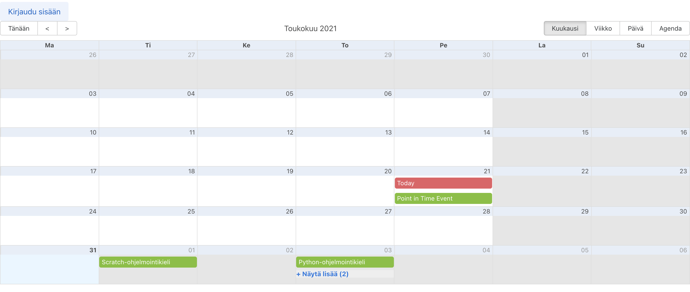
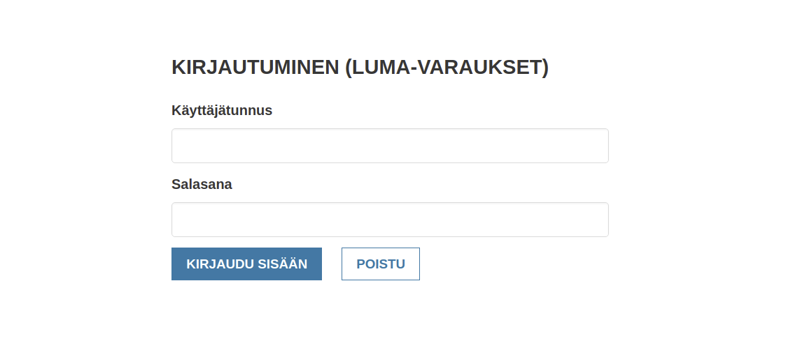
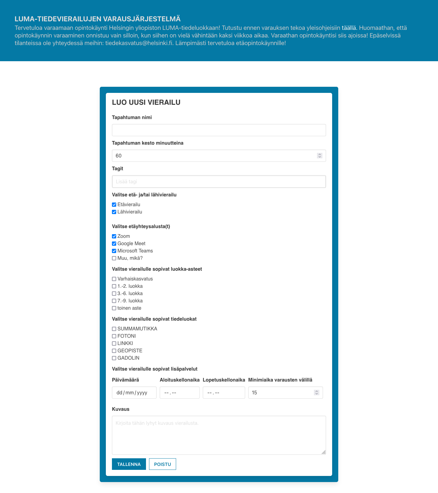
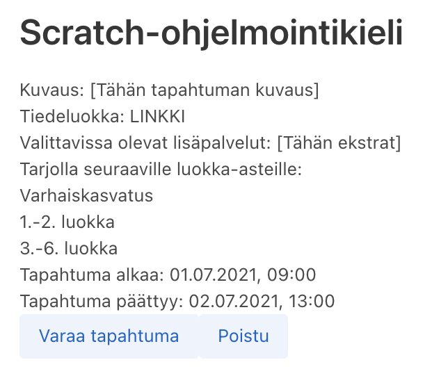
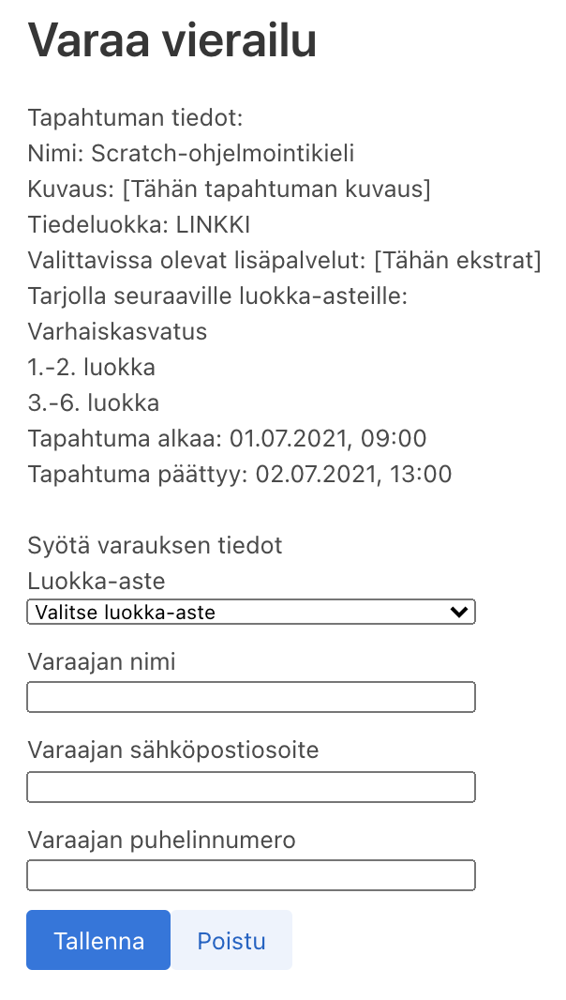
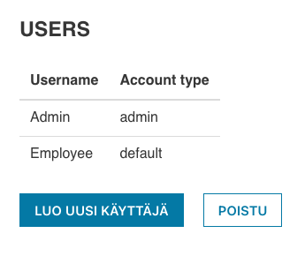
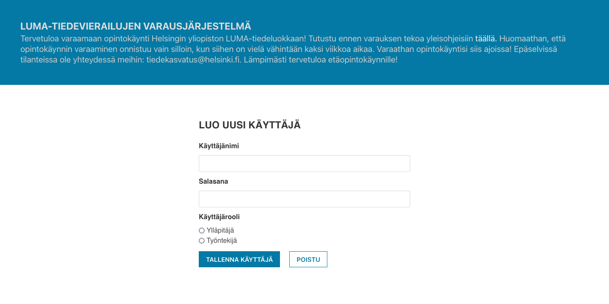

# Käyttöohjeet

## Etusivu
Sovelluseen rekisteröidyt tapahtumat ovat kaikkien nähtävillä ja
näkyvät sovelluksen etusivulta sijaitsevassa kalenterissa.



## Kirjautuminen
Sovellukseen voi kirjautua osoitteen ```/admin``` kautta.



## Tapahtuman luonti
Kirjautunut käyttäjä voi luoda yksittäisen vierailun järjestelmään.
Vierailun luonti tapahtuu napsautamalla ```Luo uusi vierailu```-näppäintä,
mikä siirtää selaimen vierailun luovaan lomakkeelle.

Lomakkeeseen lisättävät tiedot ovat:
 * tapahtuman nimi,
 * tagit,
 * tapahtuman luokka-aste,
 * tiedeluokka,
 * päivämäärä,
 * aloitus- ja lopetuskellonajat, sekä
 * tapahtumaa kuvaus.

Sen jälkeen kun olet syöttänyt lomakkeeseen tarvittavat tiedot, napsauta ```Tallenna```-näppäintä.



## Tapahtuman katselu
Tapahtuman voi valita kalenterinäkymästä,
joilloin selain ohjautuu tapahtuman sivulle.
Tapahtuman sivusta näkee tapahtuman tiedot
ja sieltä voi tehda tapahtumaan vieraulun varauksen.



## Varauksen luonti
Kun käyttäjä on napsauttanut tapahtuman sivusta lyötyvää ```Varaa vierailu```-näppäintä,
hänet ohjataan vieraulun varaussivulle. Kun käyttäjä on syöttänyt lomakkeeseen tiedot ja
napsauttanut ```Tallenna```-näppäintä, hän saa varauksen tunnuksen ja
varauksen perumista varten pin-koodin.



## Käyttäjien listaus
Ylläpitäjä voi nähdä sovelluseen rekisteröidyt käyttäjät siirtymällä osoitteelle ```/users```.



## Uuden käyttäjän luonti
Ylläpitäjä voi luoda käyttäjän varausjärjestelmään siirtymällä osoitteelle ```/users/create```.
Uuden käyttäjän käyttäjänimi ja salasana kirjoitetaan lomakkeeden kenttiin.
Valintanapilla ```Käyttäjärooli``` voi valita onko uusi käyttäjä ylläpitäjä vai työntekijä.


