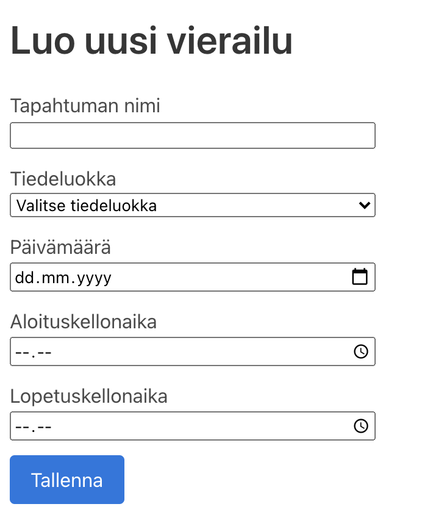

# Käyttöohjeet

## Asennus
Sovellus käyttää [node.js](nodejs.org/) ympäristöä ja
sen pakkausten hallintaan työkalua npm.
Molempien tulee olla asennettuna, jotta sovellus voi toimia.
  * Kloonaa tämä github-repositio: ```git clone https://github.com/lumawelhot/Luma-varaukset```
  * Asenna projektin `frontend` ja `backend` riippuvuudet:
    1. siirry `frontend` hakemistoon ```cd frontend/``` ja
    2. asenna tarvittavat riippuvuudet kirjoittamalla komennon ```npm install```
    3. siirry `backend` hakemistoon ```cd backend/``` ja
    4. asenna tarvittavat riippuvuudet kirjoittamalla komennon ```npm install```

## Käynnistys
Frontendin ja backendin pitää olla samanaikaisesti päällä.
Siirry `frontend` hakemistoon ja käynnistä sovelluksen `frontend`  kirjoittamalla komennon ```yarn run```.
Siirry sitten `backend` hakemistoon ja käynnistä sovelluksen `backend`  kirjoittamalla komennon ```npm run```.


## Tapahtumien katselu
Sovelluseen rekisteröidyt tapahtumat ovat kaikkien nähtävillä ja
näkyvät sovelluksen etusivulta sijaitsevassa kalenterissa.

## Kirjautuminen
Ylläpitäjät ja työntekijät voivat kirjautua sovellukseen kirjautumis linkin kautta.
Käyttäjätunnus ja salasana kirjoitetaan niiden kentille ja painetaan ```Kirjaudu sisään```-näppäintä.


## Tapahtuman luonti
Kirjautunut käyttäjä voi luoda yksittäisen vierailun järjestelmään.
Vierailun luonti tapahtuu painamalla ```Luo uusi vierailu```-näppäintä,
mikä siirtää selaimen vierailun luovaan lomakkeelle.
Lomakkeeseen lisätään tarvittavat tiedon, kuten tapahtuman nimi, paikka ja aika.
Sen jälkeen kun olet syöttänyt lomakkeeseen tarvittavat tiedot paina ```Tallenna```-näppäintä.



## Ylläpitäjän ohjeet

### Uuden käyttäjän luonti
Ylläpitäjä voi luoda käyttäjän varausjärjestelmään siirtymällä osoitteelle ```/users/create```.
Uuden käyttäjän käyttäjänimi ja salasana kirjoitetaan lomakkeeden kenttiin.
Valintanapilla ```Käyttäjärooli``` voi valita onko uusi käyttäjä ylläpitäjä vai työntekijä.


### Käyttäjien listaus
Ylläpitäjä voi nähdä sovelluseen rekisteröidyt käyttäjät siirtymällä osoitteelle ```/users```.
