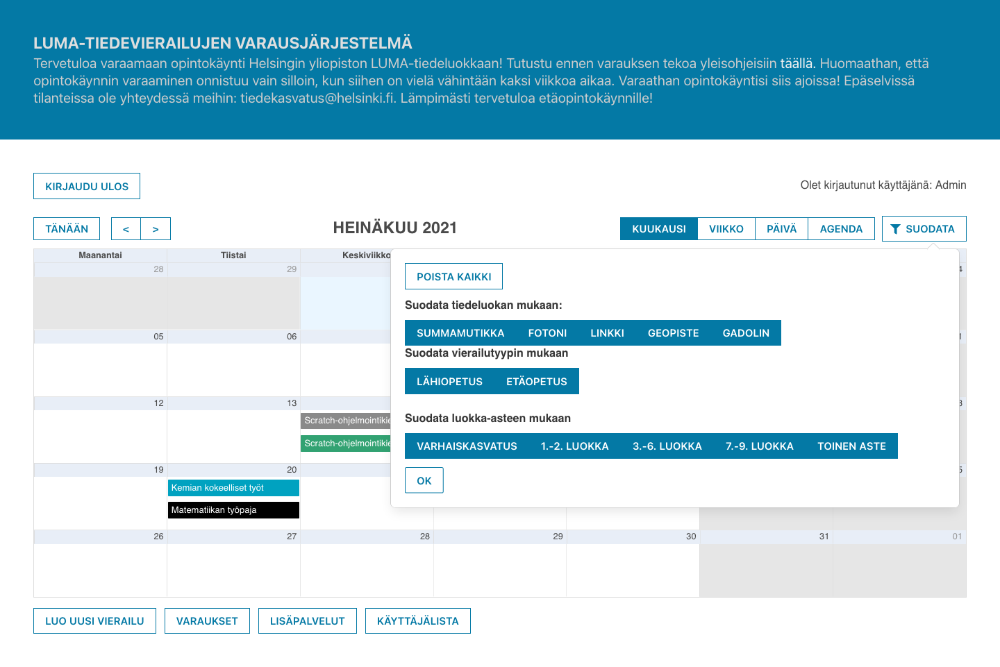
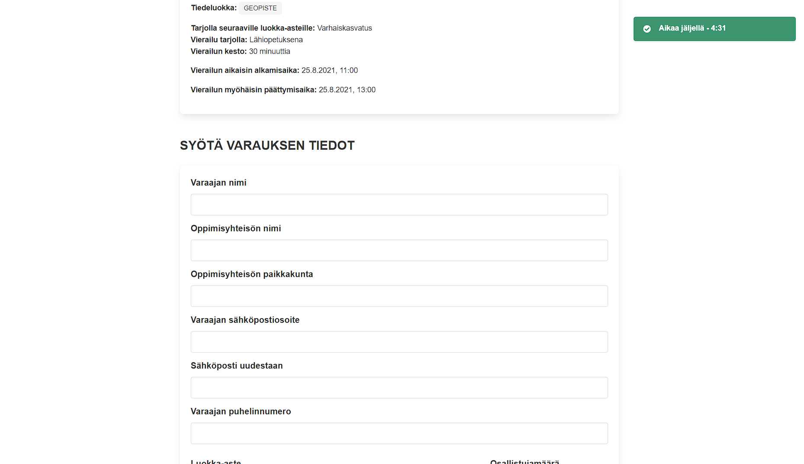
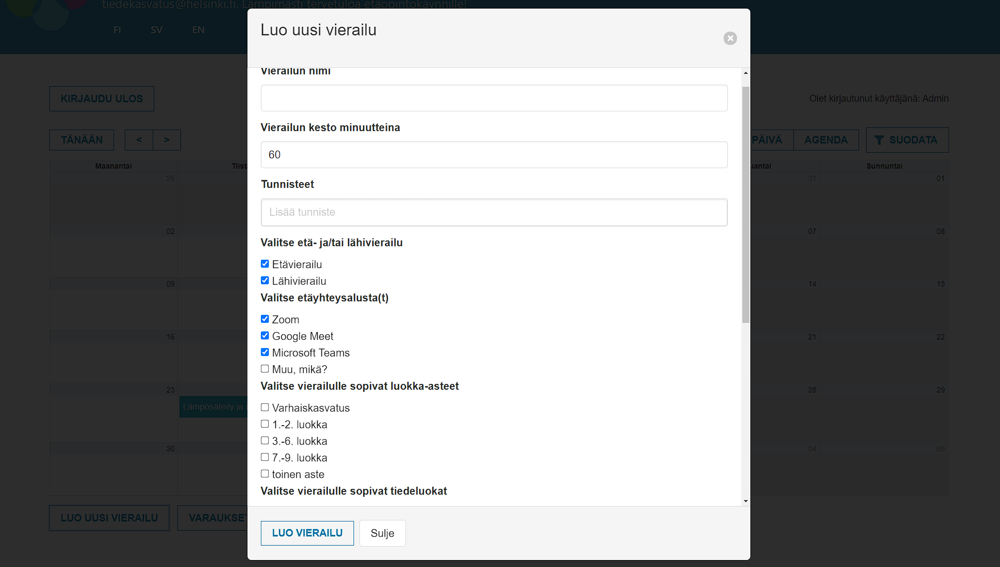
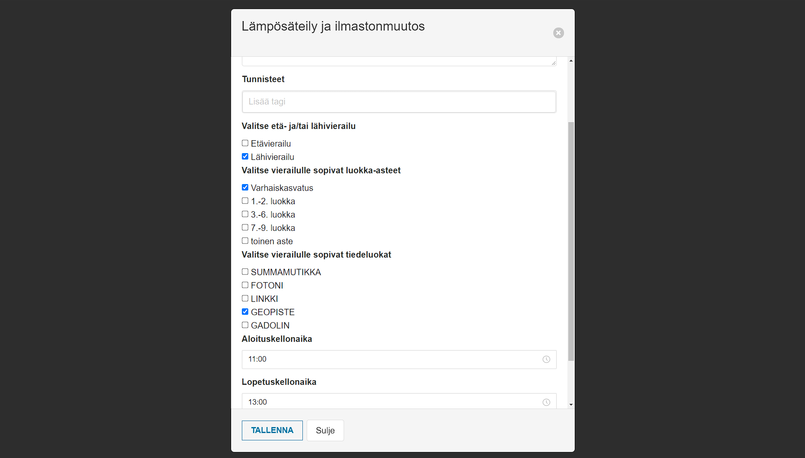
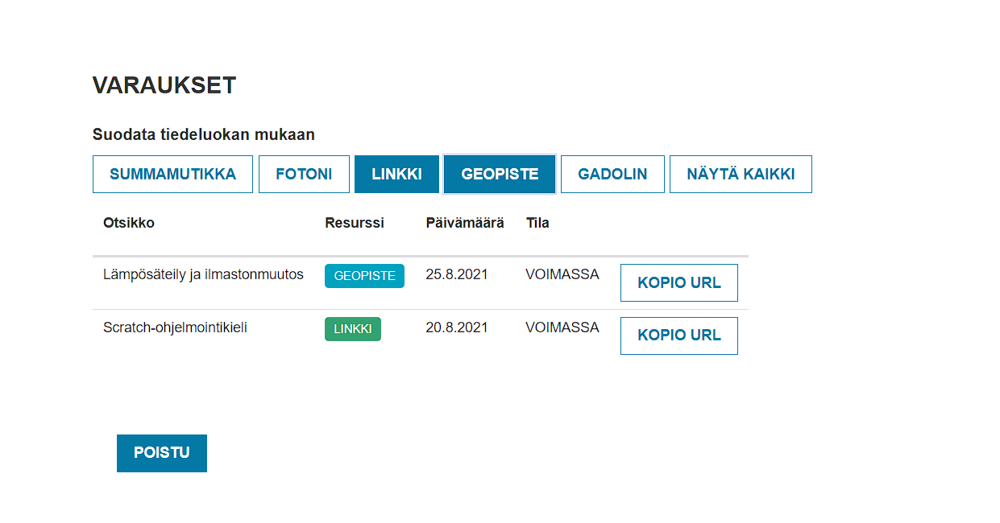
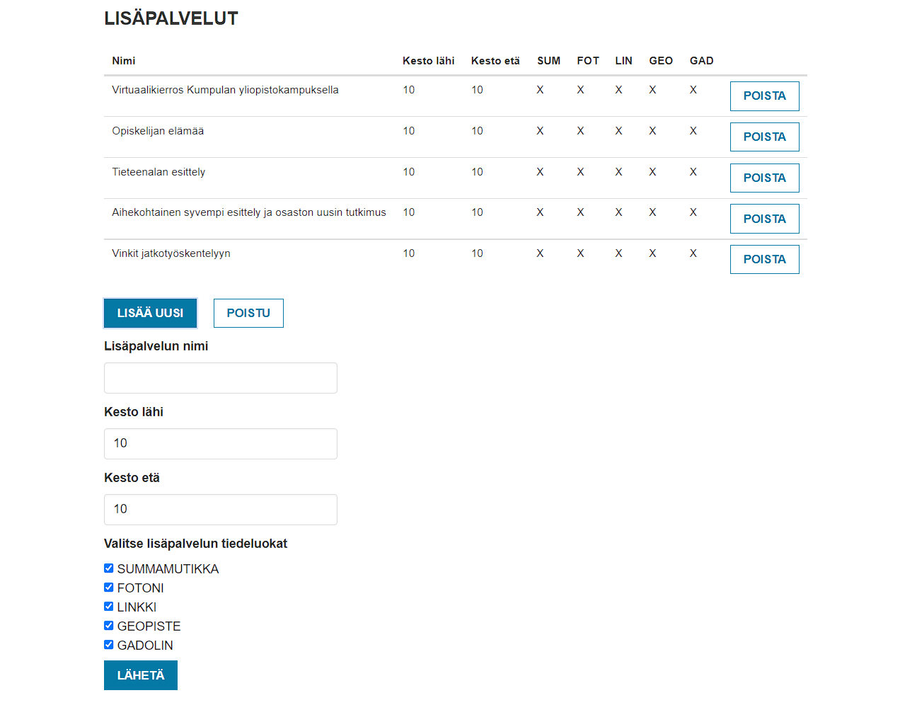
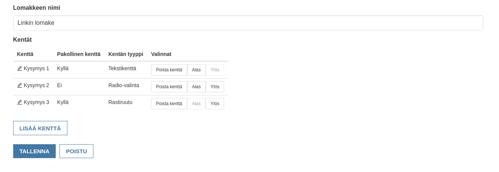
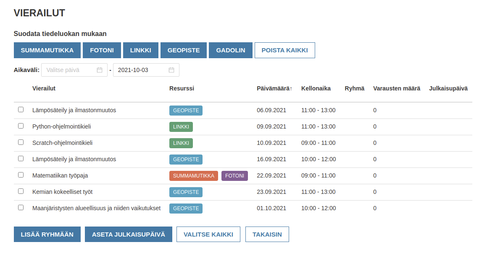
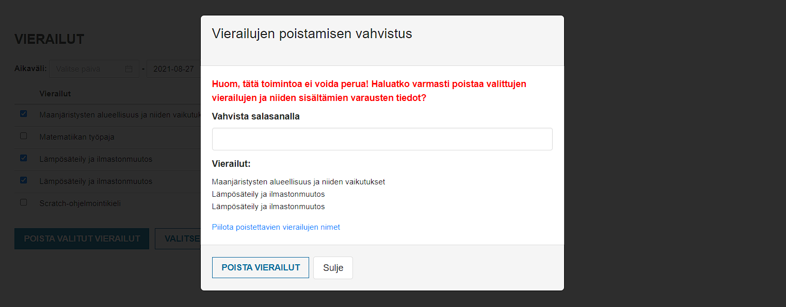

# Käyttöohjeet

---

## Kaikille avoimet toiminnallisuudet

### Etusivu
Sovellukseen syötetyt vierailut ovat kaikkien nähtävillä ja näkyvät sovelluksen etusivulla sijaitsevassa kalenterissa. Varattavissa olevat vierailut näkyvät niihin liittyvän tiedeluokan väreissä, jo varatut vierailut näkyvät harmaana. Monitieteiset vierailut näkyvät tällä hetkellä mustalla.


### Vierailujen suodatus
Kalenterissa näkyvät vierailut voi suodattaa sivustolla olevan suodatuslomakkeen avulla. Suodatinvaihtoehtoina ovat tunniste, tiedeluokka, vierailutyyppi (etä- tai lähiopetus) sekä luokka-aste. Oletusarvoisesti kaikki vierailut näytetään. ```Suodata```-nappia klikkaamalla pystyy  avaamaan suodatuslomakkeen. Kenttä, jolla määritellään suodatus tunnisteiden perusteella on oletusarvoisesti tyhjä, jolloin kalenterissa näkyy kaikki vierailut riippumatta tunnisteista. Lisäämällä yksi tai useampi tunniste, voidaan määrittää millä tunnisteilla halutaan näyttää kalenterissa olevat vierailut. Jokaisen suodatustyypin perässä on ```Poista kaikki``` tai ```Näytä kaikki``` nappula, joista toinen on näkyvissä riippuen siitä, millä tavalla suodatukset ollaan kyseisellä suodatustyypin rivillä on valittu. Suodatuslomakkeen sulkeminen onnistuu painamalla ```OK``` tai ```Suodata``` nappulaa.



### Vierailun katselu
Vierailun voi valita kalenterinäkymästä, jolloin selain ohjautuu vierailun sivulle. Vierailun sivulta näkee vierailun tiedot, ja sieltä voit tehdä varauksen, jos vierailu on varattavissa.

<p align="center">
  
</p>

### Varauksen luonti
Vierailun sivulla olevaa ```Varaa vierailu``` nappulaa painamalla pääset vierailun varauslomakkeeseen. Lomakkeen täyttämiseen on varattu 5 minuuttia aikaa, jonka aikana kukaan muu käyttäjä ei voi varata vierailua. Mikäli aika loppuu kesken ja vierailua ei olla ehditty varaamaan, vapautuu tällöin vierailu taas varattavaksi sovelluksen muille käyttäjille. Ensisijaisesti vierailun varauksen voi tehdä vain käyttäjä joka on pitänyt lomaketta yhtäjaksoisesti auki maksimissaan annetun viiden minuutin ajana. Vierailu on kuitenkin mahdollista varata annetun viiden minuutin jälkeen jos kukaan muu käyttäjä ei ole avannut varauslomaketta. Kun varauslomakkeen kentät on täytetty tarvittavilla tiedoilla, voidaan lomake lähettää painamalla ```Varaa vierailu``` nappulaa lomakkeen alaosassa. Varausvahvistus lähetetään lomakkeen onnistuneen lähettämisen jälkeen annettuun sähköpostiosoitteeseen.

<p align="center">
  
</p>

---

## Kirjautumista vaativat toiminnallisuudet

### Kirjautuminen

Sovellukseen voidaan kirjautua painamalla keltaista avaimen kuvaa kalenterin oikeassa alalaidassa. Vain tiedeluokkien työntekijät ja ylläpitäjät voivat kirjautua sovellukseen. Ylläpitäjällä on samat oikeudet kuin työntekijällä, sekä joitakin lisäoikeuksia.

<p align="center">
  
</p>

### Vierailun luonti lomakkeella

Kirjautuneena käyttäjänä vierailun voi luoda kolmella eri tavalla. Vierailu voidaan luoda kalenterissa näkyvää ```Luo uusi vierailu``` painiketta painamalla, raahaamalla vierailulle haluttu aikaikkuna kalenterinäkymässä tai siirtämällä olemassa olevaa vierailua toiseen paikkaan kalenteria ja painamalla kopioi painiketta ilmestyneestä ponnahdusikkunasta. Kaikki edellä mainitut tavat avaavat vierailun luontilomakkeen, mutta valittu tapa vaikuttaa siihen, miten lomake on esitäytetty kun se avautuu. Kopioinnin yhteydessä avautuva lomake sisältää kaikki tiedot valmiiksi esitäytettyinä.

Lomakkeeseen lisättävät tiedot ovat:
 * vierailun nimi
 * kesto minuutteina
 * tagit (valinnainen: voit valita valmiista listasta tai lisätä omasi)
 * vierailutyyppi (etä/lähi)
 * etäyhteysalusta (jos etävierailu on valittu vaihtoehdoksi),
 * luokka-asteet
 * tiedeluokka
 * päivämäärä
 * aloitus- ja lopetuskellonajat
 * vierailun kuvaus
 * valintaruutu mahdollisten räätälöityjen lomakkeiden lisäämiseksi

Kun lomake on täytetty kaikilla tarvittavilla tiedoilla, voidaan vierailu tällöin julkaista varattavaksi painamalla ```Luo vierailu``` painiketta lomakkeen alaosassa.

<p align="center">
  
</p>

### Vierailun muokkaaminen

Jo olemassa olevan vierailun tietoja voidaan muokata painamalla vierailun sivulla olevaa ```Muokkaa tietoja``` painiketta. Muokkauslomake on esitäytetty muokattavan vierailun tiedoilla, joita voidaan muuttaa käyttäjän haluamalla tavalla. Kun halutut muutokset on tehty voidaan ne tallentaa painamalla ```Tallenna``` nappulaa.

<p align="center">
  
</p>

### Vierailun siirtäminen

Olemassa olevan vierailun paikkaa voidaan siirtää raahaamalla vierailua toiseen paikkaan kalenterinäkymässä ja painamalla siirtämisen jälkeen ilmestyvässä ponnahdusikkunassa ```Siirrä``` painiketta. Tämän jälkeen käyttäjälle avauttuu vierailun muokkauslomake, joka on esitäytetty vierailun muilla tiedoilla, sekä sen uudella ajankohdalla. Vierailu voidaan siirtää painamalla ```Tallenna``` nappulaa.

### Varausten listaus

Vierailuihin tehdyt varaukset voidaan listata painamalla kalenterin alla olevaa ```Varaukset``` painiketta. Listauksessa näkyy joitain tietoja, kuten otsikko, tiedeluokka ja päivämäärä. Tarvittaessa lisätietoja varauksesta nähdään painamalla varauksen otsikkoa, jonka tietoja halutaan tarkastella. Listauksessa olevia varauksia voidaan suodattaa tiedeluokan mukaan ja se sisältää toiminnallisuuden kopioida tarvittaessa leikepöydälle URL-osoite, jolla pääsee vierailun sivulle ja joka voidaan välittää eteenpäin muissa sovelluksissa.

<p align="center">
  
</p>

### Lisäpalvelut

Olemassa olevien lisäpalveluiden listauksen pääsee näkemään painamalla kalenterinäkymän alapuolella olevaa ```Lisäpalvelut``` painiketta. Listauksessa näkyy, mille tiedeluokille lisäpalvelut on tarkoitettu ja niiden kestot riippuen onko kyseessä etä- tai lähivierailu. Lisäpalvelu voidaan lisätä painamalla ```Lisää uusi``` painiketta ja lähettämällä painikkeen alle ilmestynyt lomake halutuilla tiedoilla.

<p align="center">
  
</p>

### Räätälöityjen lomakkeiden luominen

Sovellus mahdollistaa räätälöityjen lomakkeiden luomisen, jotka voidaan lisätä vierailun varauslomakkeeseen täytettäviksi lisäkentiksi. Mahdollisia lisäkenttiä ovat teksti-, radio-valinta- ja rastiruutu-kentät. Räätälöidylle lomakkeelle voidaan antaa nimi riippuen esimerkiksi lomakkeen käyttötarkoituksesta. Kenttien järjestystä voidaan myös vaihtaa tai tarpeettomaksi jääneitä kysymyskenttiä voidaan poistaa. Räätälöidyt lisälomakkeet lisätään vierailukohtaisesti. Mikäli lomaketta muutetaan tai se poistetaan, pysyvät jo syötetyt tiedot kuitenkin tallessa. 

<p align="center">
  
</p>

## Ylläpitäjän oikeuksia vaativat toiminnallisuudet

### Käyttäjien listaus

Käyttäjien listaukseen pääsee painamalla kalenterinäkymän alla olevaa painiketta ```Käyttäjälista```. Listauksesta näkyy sovellukseen rekisteröidyt käyttäjät  käyttäjänimellä ja oikeuksilla. Listattujen käyttäjien käyttäjätunnuksia, salasanaa ja oikeuksia voidaan muokata, sekä tarvittaessa käyttäjiä voidaan myös poistaa. Kirjautunut ylläpitäjä on kuitenkin rajoitettu siten, että se ei voi poistaa omaa käyttäjäänsä tai muuttaa oman käyttäjänsä oikeuksia. Listauksen alla näkyy myös painike uuden käyttäjän luonnille, joka avaa lomakkeen käyttäjän luomista varten.

<p align="center">
  
</p>

### Vierailujen listaus

Vierailujen listaukseen pääsee painamalla ```Vierailulista``` painiketta kalenterinäkymän alaosassa. Listauksessa näkyy kaikki vierailut valitulta aikaväliltä. Oletusarvoisesti listaus näyttää vain menneet vierailut turvallisuussyistä (estetään vahingot). Listauksessa näkyy vierailujen nimet, päivämäärät, kellonajat ja tiedeluokat.

<p align="center">
  
</p>

### Vierailujen ja niihin liittyvien varausten tietojen poistaminen

Vierailujen listauksessa on mahdollista valita ne vierailut joihin liittyvät tiedot halutaan poistaa sovelluksen tietokannasta kokonaan. Poistettaviin tietoihin kuuluvat vierailu ja siihen liittyvät varaukset. Ennen poistamista valitaan ne vierailut jotka halutaan poistaa ja painetaan painiketta ```Poista valitut vierailut```. Poistamista ei voi tehdä vahingossa, sillä ennen poistamista ylläpitäjältä kysytään varmistuksena salasanaa. Ennen poistamista pääsee tarvittaessa näkemään vielä yhteenvedon niiden vierailujen nimistä, jotka tullaan poistamaan.

<p align="center">
  
</p>
