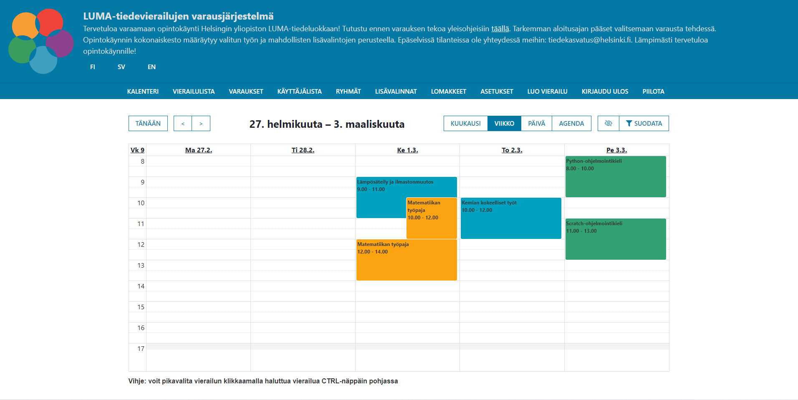

# LUMA-varaukset v3 & v4

*Kuvakaappaus varausjärjestelmän etusivusta ylläpitäjän näkökulmasta.*

---

## Merkittävimmät uudistukset v2 -> v3 & v4

Varausjärjestelmä otettiin tuotantokäyttöön lokakuussa 2021 ja sitä on käyttöön oton jälkeen paranneltu huomattavasti. Versio v3 toi mukanaan kolme laajaa uudistusta sovelluksen frontendiin:
* Uudistunut käyttöliittymä
    * työntekijälle näkyvä navigaationäkymä siirrettiin kalenterin yläpuolelle
    * lomakkeita paranneltiin
    * käyttöliittymä säilytti alkuperäisen ilmeensä, mutta siitä tehtiin intuitiivisempi käyttää
* Välimuistin käyttö
    * v2 suurin heikkous oli, että välimuistia ei käytetty lainkaan
    * välimuisti toteutettiin useState ja useContext hookkien avulla
* Mobiiliystävällisyys
    * varausjärjestelmä v2 ei ollut mobiiliystävällinen, mobiili ystävällisyyttä on paranneltu huomattavasti
* Koodin laadun parannuksia
    * lisätty modulaarisuutta

Version v4 muutokset tapahtuivat suurilta osin sovelluksen konepellin alla. Varausjärjestelmän v4 uudistukset koskivat koko varausjärjestelmän koodia:
* Frontendin välimuisti uudistettu, useState hookkien sijasta useReducer käyttö
    * harkinnassa oli Apollo Client cachen tai Reduxin käyttö, mutta useReducer valikoitui tarkoitukseen parhaiten räätälöitäväksi vaihtoehdoksi
* Vanhentuneita kirjastoja on päivitetty/korvattu uudempiin sekä frontin ja backin puolella
* Frontendin lomakkeista vastanneesta Formikista luovuttu ja tilalle react-hook-form parantaakseen lomakkeiden suorituskykyä ja vähentääkseen tarpeettoman koodin määrää lomakkeissa
* Laajaa refactorointia backendin koodiin
    * luotu rajapinta tietokannan käyttöä varten
    * parannettu huomattavasti koodin laatua
* Huomattava määrä uusia testejä
    * v2 testit jouduttiin korvaamaan uusilla backendin laajan refactoroinnin ja teknisen velan vuoksi
    * testaus kirjasto vaihdettiin Jest -> Mocha
        * Jestillä oli haasteita toteuttaa stubeja, joilla olisi voitu korvata tietokanta rajapinta
    * yli 140 uutta testiä testaamaan backendin logiikkaa

## Ominaisuudet

Varausjärjesltemä sisältää useita käyttökelpoisia ominaisuuksia tiedevierailujen tarjoamiseen. Alla on karkea kuvaus käyttäjäroolikohtaisista ominaisuuksista.

#### Opettaja

* Vierailujen tarkasteleminen kalenterinäkymässä
* Vierailujen suodattaminen tagien, tiedeluoka ja luokka-asteen mukaan
* Vierailun varaaminen
* Vierailun peruuminen
* Varauksen tietojen tarkastelu
* Onnistuneesta varauksesta vahvistus viesti sähköpostiin
* Varausjärjestelmän kielen vaihtaminen (FI/SV/EN)

#### Työntekijä

* Vierailujen luominen, muokkaaminen ja poistaminen
* Varauksen tietojen muokkaaminen
* Mahdollisuus luoda lisävalintoja, joita voidaan lisätä valituille vierailuille
* Julkaisuajankohdan määrittäminen vierailulle
* Ryhmät
    * vierailu voidaan lisätä ryhmään
    * ryhmille voidaan asettaa maksimi vierailukiintiö
* Vierailuja ja varauksia voidaan tarkastella listaus näkymässä
* Räätälöityjen lomakkeiden luominen, muokkaaminen ja poistaminen
    * voidaan käyttää varauslomakkeessa lisätietojen täyttämistä varten
    * peruutuslomakkeen määrittäminen, joka esitetään varaajalle mikäli hän haluaa perua vierailun
* Voi ladata CSV tiedoston, joka sisältää käyttökelpoista dataa esimerkiksi raportointia varten
* Vierailun poistaminen käytöstä, jotta uusia varauksia ei voida enään tehdä
* Paljon muita hienostuneita ominaisuuksia tehdäkseen työntekijän työstä mahdollisimman yksinkertaista ja suoraviivaista

#### Ylläpitäjä

* Hallinnoi käyttäjätunnuksia ja niiden salasanoja
* Sähköpostipohjien sisällön määrittäminen